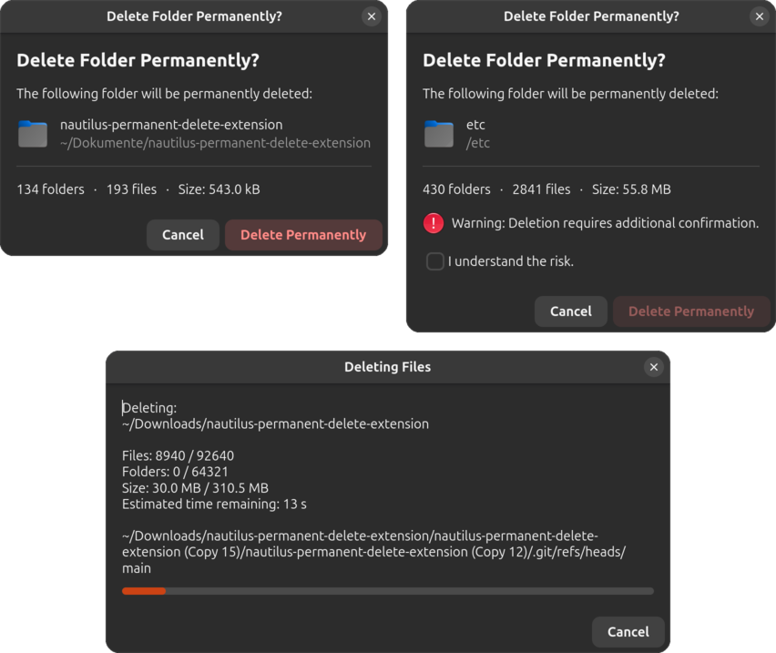

# Nautilus Permanent Delete Extension

A Nautilus Python extension that provides an alternative permanent delete workflow with its own confirmation and progress dialogs.



## Warning

This extension permanently deletes files and folders.

Deleted data cannot be recovered. Always verify the selected items before confirming a deletion.

Use at your own risk.

## Features

* Permanent delete context menu entry for Nautilus
* Shift+Delete keyboard shortcut
* Custom confirmation dialog with file and folder preview
* Progress dialog with file count, size information and estimated remaining time
* Optional blacklist rules requiring an additional confirmation
* Optional whitelist rules for trusted locations
* Runtime error handling with detailed failure reporting
* Full translation support
* GTK4 and Nautilus 4 compatible

## Installation

Choose one of the following installation methods:

### ZIP Release (Recommended)

See:

* [docs/INSTALL_ZIP.md](docs/INSTALL_ZIP.md)

### Git Repository

See:

* [docs/INSTALL_GIT.md](docs/INSTALL_GIT.md)

## Optional User Configuration

Create the configuration directory:

```bash
mkdir -p ~/.config/nautilus-permanent-delete-extension
```

Copy the example files:

```bash
cp ~/.local/share/nautilus-python/extensions/nautilus-permanent-delete-extension/example_user_blacklist_paths.conf \
   ~/.config/nautilus-permanent-delete-extension/user_blacklist_paths.conf

cp ~/.local/share/nautilus-python/extensions/nautilus-permanent-delete-extension/example_user_whitelist_paths.conf \
   ~/.config/nautilus-permanent-delete-extension/user_whitelist_paths.conf
```

Edit the files and add your own rules:

```bash
editor ~/.config/nautilus-permanent-delete-extension/user_blacklist_paths.conf

editor ~/.config/nautilus-permanent-delete-extension/user_whitelist_paths.conf
```

After changing these files, restart Nautilus:

```bash
nautilus -q
```

### Configuration Files

#### `user_blacklist_paths.conf`

Paths matching these rules require an additional confirmation before they can be permanently deleted.

#### `user_whitelist_paths.conf`

Paths matching these rules skip the normal delete confirmation dialog and can be deleted immediately. Whitelist entries take precedence over blacklist entries.

The file format and matching rules are documented in the comments inside the example files.

## License

MIT License

